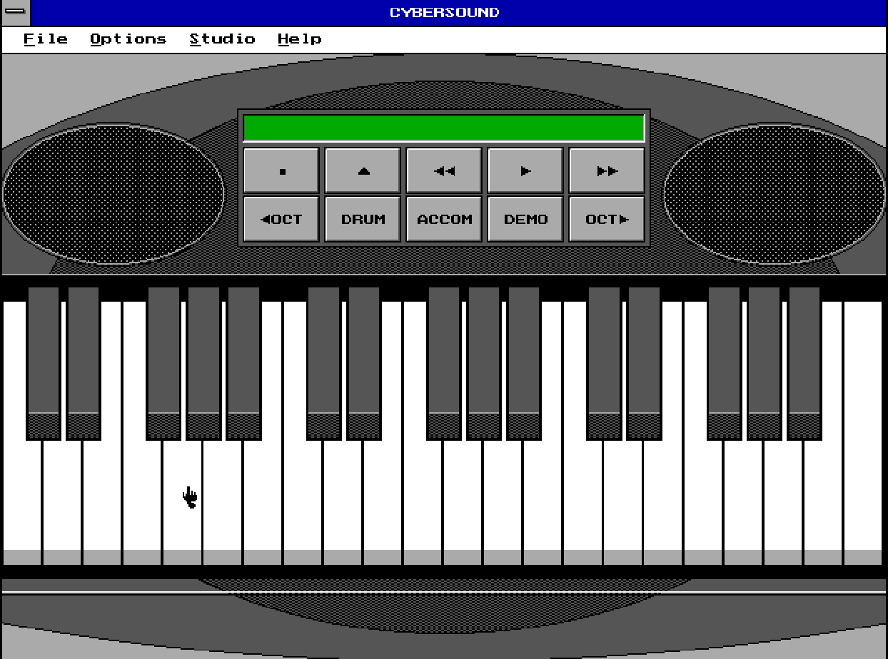

# Cybersound

# slamdunk

My music application written in Pascal during childhood.

The operating system is MS DOS, so this is running under emulation.

You can play and record your tunes, save/load from disk. 

I put a lot of nights on this one, the software is almost complete!

[click here to play!](https://blaisetine.github.io/cybersound)
